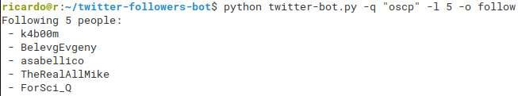
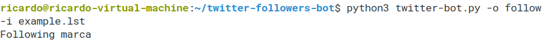
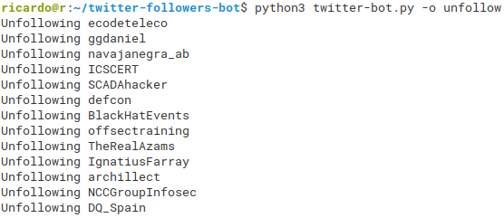
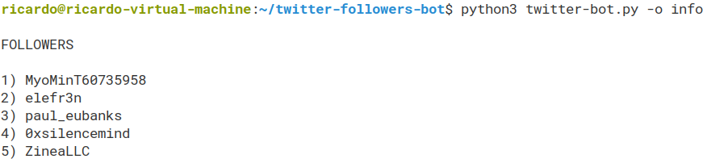
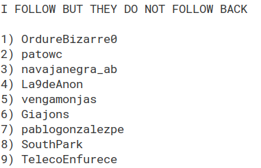
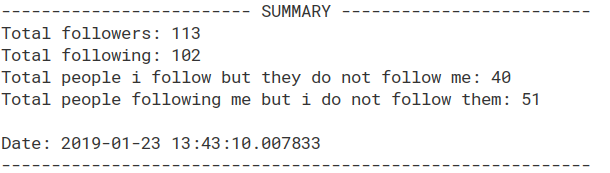

# twitter-bot
A bot for Twitter.**OPTIONS**: Follow users from query, geocode or list; unfollow who do not follow back (and are not included in *whitelist.txt*); create reports (containing followers, followings, people who do not follow me back and people i do not follow back). 


## Usage

Follow people who tweeted a word (**query**), limited to the **limit** value:
```
python twitter-bot.py -q {query} -l {limit} -o follow
```

Follow people who tweeted in a location (**geocode**), limited to the **limit** value:
```
python twitter-bot.py -g {geocode} -l {limit} -o follow
```

Follow users from a list file
```
python twitter-bot.py -o follow -i test.lst
```

Unfollow people who do not follow you back:
```
python twitter-bot.py -o unfollow
```

Show report (followers, followings, people who do not follow me back and people i do not follow back)
```
python twitter-bot.py -o info
```


## Example

Follow 5 people who tweeted 'oscp':

```
python twitter-bot.py -q "oscp" -l 5 -o follow
```


Follow 7 people tweeting in 40.432,-3.708:

```
python3 twitter-bot.py -g "40.432,-3.708,10km" -l 7 -o follow
```


Follow users in example.lst:
```
python3 twitter-bot.py -o follow -i example.lst
```


Unfollow people who i follow butt they do not follow me back:

```
python3 twitter-bot.py -o unfollow
```


```
python3 twitter-bot.py -o info
```


(...)



(...)




## Requirements

Python 2.x:
```
sudo pip install -r requirements.txt
```

Python 3.x:
```
sudo pip3 install -r requirements.txt
```

*Create a twitter account and a twitter app, and fill the **config.py** file with the data you can create in https://developer.twitter.com*

## Note

Tested both in Python2.x (2.7.15rc1) and Python 3.x (3.6.7)

